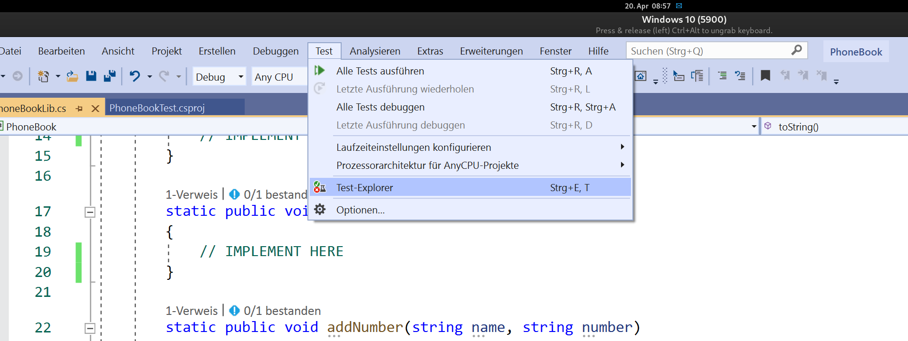
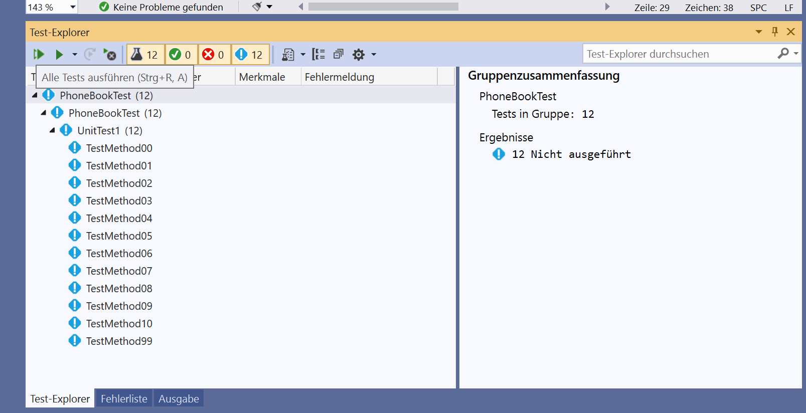
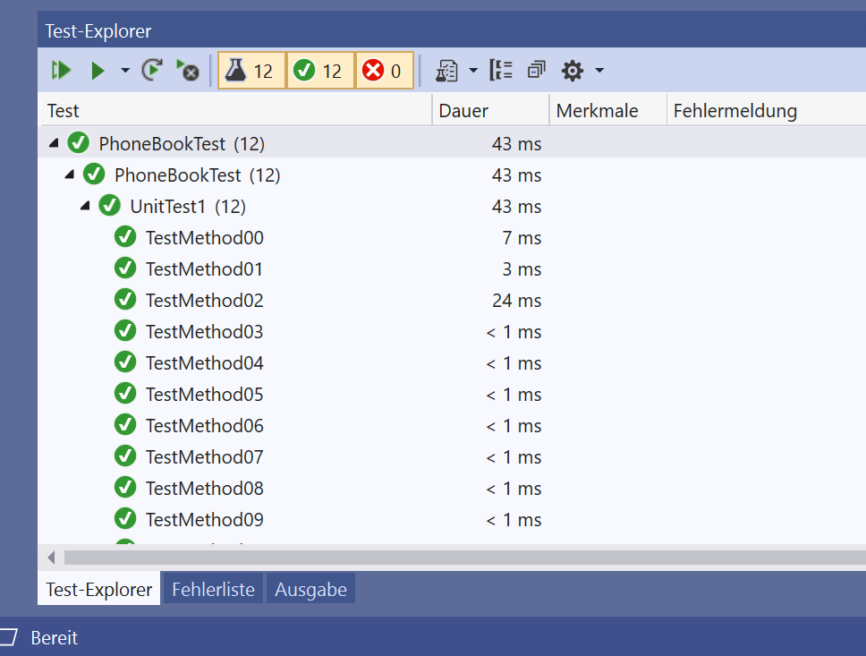

# It's all about testing

In diesem Assignment geht es ums Testen. 
Ich habe Ihnen die Arbeit abgenommen die Tests zu schreiben, aber es fehlt die Implementation.

Ihre Aufgabe wird es sein die Funktionalität hinzuzufügen.

## Aufgabenstellung

Öffnen Sie das Solution-File, welches im Repository liegt, mit Visual-Studio.

Lassen Sie sich im Visual Studio, wie im Screenshot ersichtlich, den Test-Explorer anzeigen.

Sie sollten die Test-Explorer Erweiterung angezeigt bekommen, die folgendermaßen aussieht.

Sie können nun die Tests über den Button "Alle Tests ausführen" starten. Wie Sie sehen werden, scheitern einige der Tests.

Ihre Aufgabe besteht nun darin die fehlende Funktionalität __ausschließlich__ in der Datei _PhoneBookLib.cs_ zu implementieren.

Sie können jederzeit die Tests ausführen und einem nach dem anderen zum Laufen bringen. 

So können Sie selber Ihre Aufgabe und Ihren Fortschritt begutachten.

Ihr Ziel haben Sie erreicht, wenn der Testlauf folgendes Ergebnis bringt:

Wenn es zu Problemen kommt, dann Comitten und Pushen Sie bitte Ihren Code und sprechen mich im Teams an.

Viel Erfolg und Spaß beim Coden.

